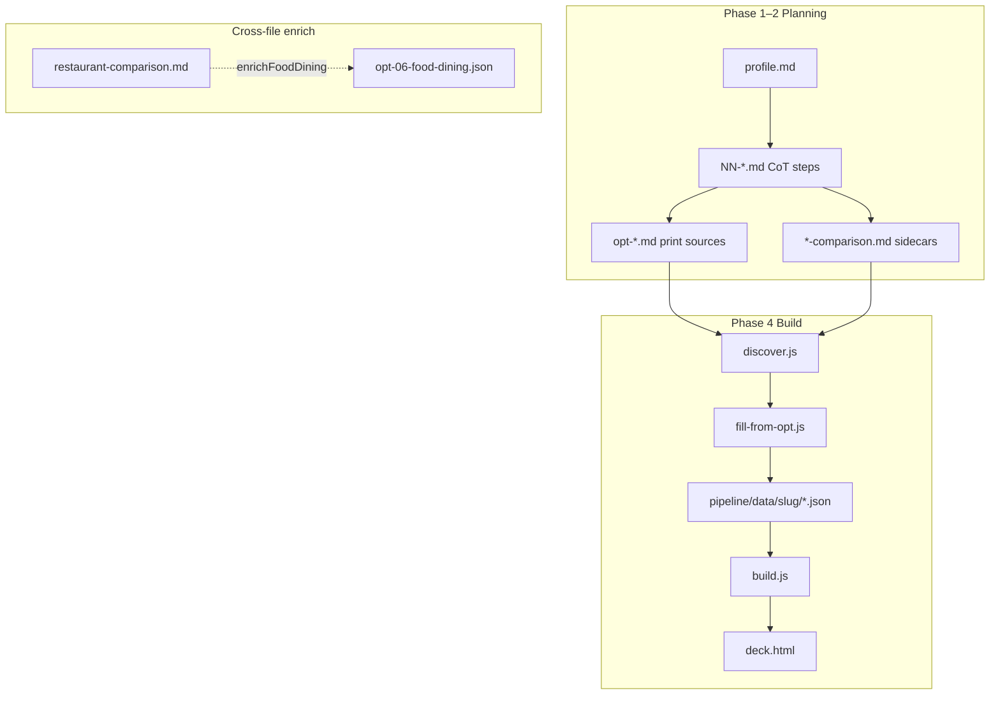
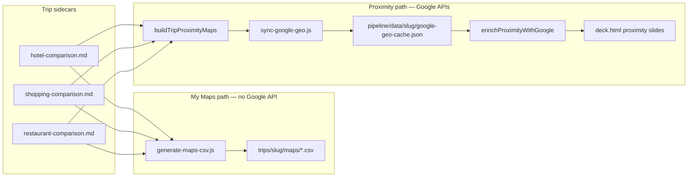

# travel-genie

Turn a single **traveler profile** into a polished, print-ready **travel deck** (HTML + PDF) using a 17-step chain-of-thought (CoT) planning workflow and a deterministic rendering pipeline.

**Live itinerary:** [China · Vietnam 2026](https://tolsonj.github.io/travel-genie/trips/china-vietnam-2026/) · [Activity chart](https://tolsonj.github.io/travel-genie/trips/china-vietnam-2026/chart.html) · [Hotels](https://tolsonj.github.io/travel-genie/trips/china-vietnam-2026/#hotels)

```
profile.md ──▶ CoT steps 01–17 ──▶ opt-*.md ──▶ canonical JSON ──▶ trip.html   (primary)
 (you write)     (AI planning)      (print src)   (extract)        (site)
                                                                  ──▶ deck.html  (optional --deck)
                                                                  ──▶ deck.pdf   (optional --pdf)
```

---

## Table of contents

1. [Development stack](#development-stack)
2. [Concepts & layout](#concepts--layout)
3. [First-time setup](#first-time-setup)
4. [The complete process](#the-complete-process)
5. [Quick start (fully automated)](#quick-start-fully-automated)
6. [Running every step individually](#running-every-step-individually)
7. [Regenerating pipeline data](#regenerating-pipeline-data)
8. [Example agent prompts](#example-agent-prompts)
9. [Troubleshooting](#troubleshooting)
10. [Workspace rules](#workspace-rules)
11. [Cursor extensions](#cursor-extensions)

---


## Development stack

No web framework and no build step — plain **Node.js ES modules** that read markdown and emit a single self-contained HTML file, plus a headless-browser pass for PDF.


| Tool                                                | Version / source                                    | Role in the pipeline                                                                                                                                                                              |
| --------------------------------------------------- | --------------------------------------------------- | ------------------------------------------------------------------------------------------------------------------------------------------------------------------------------------------------- |
| **Node.js**                                         | `>= 18` (tested on v20)                             | Runtime for every `pipeline/src/*.js` script. ESM (`"type": "module"`).                                                                                                                           |
| **Plain JS templates**                              | `pipeline/src/render/templates/*.js`                | Stage 2 rendering. Each aspect `type` maps to a template that returns an HTML string. No React/Vue/templating engine.                                                                             |
| **D3** (`d3.min.js`)                                | vendored in `pipeline/vendor/` (v7)                 | Draws the geographic route map — Mercator projection, country paths, hub markers. Inlined into the deck and re-run during PDF export.                                                             |
| **topojson-client** (`topojson-client.min.js`)      | vendored (v3)                                       | Decodes the world TopoJSON into GeoJSON features for D3.                                                                                                                                          |
| **Natural Earth world map** (`countries-110m.json`) | vendored (~108 KB)                                  | Base country geometry for the maps. Vendored so the deck builds **offline** and is byte-stable.                                                                                                   |
| **Playwright**                                      | `npm install --no-save playwright` (Chrome channel) | Headless Chrome used by `export-pdf.js` to render each slide and print it to PDF.                                                                                                                 |
| **pdf-lib**                                         | `npm install --no-save pdf-lib`                     | Merges the per-slide PDFs into one `deck.pdf` (and trims any overflow pages).                                                                                                                     |
| **Anthropic / OpenAI API**                          | optional, via `fetch` (no SDK)                      | **Stage 1 only.** If `ANTHROPIC_API_KEY` or `OPENAI_API_KEY` is set, `extract.js` auto-extracts JSON. Override with `ANTHROPIC_MODEL` / `OPENAI_MODEL`. Not needed when building from `opt-*.md`. |
| **Bash**                                            | `scripts/run-travel-deck.sh`                        | One-command orchestration of the build (Phase 4).                                                                                                                                                 |
| **Cursor agent skill**                              | `.cursor/skills/travel-cot-deck/`                   | Drives Phases 0–4: profile intake, CoT planning, opt files, build.                                                                                                                                |


**Runtime dependencies are zero** for rendering (`package.json` lists none — D3/topojson are vendored). Playwright + pdf-lib are installed on demand, only for the PDF step, and with `--no-save` so they never enter `package.json`.

Why this shape:

- **Vendored map assets** → identical output every run, works fully offline, no CDN.
- **Deterministic Stage 2** → the same `data/<trip>/*.json` always yields byte-identical `deck.html`.
- **AI isolated to Stage 1** → the only nondeterministic, network-dependent, optional part.

---


## Concepts & layout


| Path                                         | Purpose                                                                                                                            |
| -------------------------------------------- | ---------------------------------------------------------------------------------------------------------------------------------- |
| `prompts/Travel-Prompt-cot.md`               | The 17 chain-of-thought planning prompts (source of truth).                                                                        |
| `prompts/start-prompt.md`                    | Original kickoff prompt describing the task-list approach.                                                                         |
| `trips/<slug>/profile.md`                    | **Your input.** Predefined traveler profile.                                                                                       |
| `trips/<slug>/NN-*.md`                       | CoT step outputs (`## Reasoning` → `## Output` → `## Validation`).                                                                 |
| `trips/<slug>/opt-NN-*.md`                   | Print sources — the `**## Output` only** copy of each step. The pipeline reads these.                                              |
| `trips/<slug>/00-workflow-state.md`          | Progress tracker (enables stop / resume / redo).                                                                                   |
| `trips/<slug>/TRAVEL_MASTER.md`              | Optional assembled brief (step 18).                                                                                                |
| `trips/<slug>/flight-comparison.md`          | Optional MCP flight sidecar (full leg tables + search log).                                                                        |
| `trips/<slug>/hotel-comparison.md`           | Optional SerpAPI Hotels sidecar → dedicated HOTELS deck slide.                                                                     |
| `trips/<slug>/restaurant-comparison.md`      | Optional SerpAPI TripAdvisor sidecar (restaurants per city).                                                                       |
| `trips/<slug>/attractions-comparison.md`     | Optional SerpAPI TripAdvisor sidecar (attractions / hidden gems).                                                                  |
| `trips/<slug>/spa-comparison.md`             | Optional spa/wellness sidecar per hub → `trip.html`, `deck.html`, and `maps/spas.csv`.                                             |
| `trips/<slug>/shopping-comparison.md`        | Optional SerpAPI TripAdvisor sidecar (shopping venues per city).                                                                   |
| `trips/<slug>/maps/*.csv`                    | Google My Maps import CSVs (auto-generated from venue sidecars).                                                                   |
| `trips/<slug>/venue-addresses.json`          | Optional name→address overrides for map CSV export.                                                                                |
| `pipeline/data/<slug>/google-geo-cache.json` | Cached Google geocodes + walking distances for proximity deck slides (regeneratable).                                              |
| `pipeline/`                                  | **Local-only (gitignored).** Contains `src/`, `schema/`, `vendor/`, `data/`, `dist/`. Generated on first build.                    |
| `pipeline/data/<slug>/*.json`                | Canonical extracted data (one file per aspect). **Regeneratable** — see [Regenerating pipeline data](#regenerating-pipeline-data). |
| `pipeline/dist/<slug>/trip.html`             | Mobile-first scrollable itinerary site. **Primary deliverable.**                                                                   |
| `pipeline/dist/<slug>/deck.html`             | Slide deck (1280×720). Optional; use --deck flag.                                                                                  |
| `pipeline/dist/<slug>/deck.pdf`              | Slide PDF (Playwright). Optional; use --pdf flag.                                                                                  |
| `pipeline/dist/<slug>/maps/*.csv`            | Mirrored Google Maps CSVs (same as `trips/<slug>/maps/`).                                                                          |
| `pipeline/schema/aspect-manifest.json`       | Registry: aspect → type, slide template, extraction hints.                                                                         |
| `scripts/run-travel-deck.sh`                 | One-command build: opt files + sidecars → JSON → HTML → PDF.                                                                       |
| `scripts/build-opt-print.sh`                 | Standalone 8×10 print builder: `opt-*.md` → HTML (pandoc) → PDF (headless Chrome).                                                 |
| `scripts/check-serpapi.js`                   | SerpAPI preflight: validates API key, account status, and TripAdvisor engine access.                                               |
| `scripts/check-google-maps.js`               | Google Maps preflight: Geocoding, Distance Matrix, and Maps Static API (loads `.env` automatically).                               |
| `scripts/load-env.js`                        | Shared `.env` loader used by check scripts and `sync-google-geo.js`.                                                               |
| `scripts/opt-print.css`                      | Stylesheet for print output — 8×10 page, hero banners, tables, Caveat/Inter fonts.                                                 |
| `mcp/tripadvisor-server/`                    | Local SerpAPI TripAdvisor MCP server (`search_venues`, `get_venue_details`).                                                       |
| `poc/`                                       | Proof-of-concept route-optimization slide prototypes (HTML + screenshots).                                                         |
| `.env.example`                               | Template for local `.env` (API keys).                                                                                              |
| `.cursor/mcp.json.example`                   | MCP config template (hotels, TripAdvisor, Google Maps). Copy locally — **do not commit** `.cursor/mcp.json`.                       |
| `.cursor/rules/ironbee-devtools-use.mdc`     | Workspace rule: enforce IronBee DevTools for all browser verification.                                                             |
| `.cursor/skills/travel-cot-deck/`            | Agent skill that drives the full workflow (profile → CoT → opt → deck).                                                            |
| `.cursor/skills/travel-planning-cot/`        | Agent skill for planning only (no deck build).                                                                                     |


**Trip slug** = lowercase `{countries}-{year}` (e.g. `spain-portugal-2026`). The repo includes a fictional demo at `trips/example-trip/`.

The architecture is **two-stage and decoupled**:

- **Stage 1 — extract** (the only AI step in the pipeline): maps "similar but not identical" markdown onto one strict JSON schema. With no API key, it writes a schema-guided prompt or extracts deterministically from `opt-*.md`.
- **Stage 2 — render** (fully deterministic): same JSON always produces the same deck. No AI, no network.

---


## First-time setup

After cloning the repo you will notice that `pipeline/` and `trips/` are **gitignored** — they are generated/populated locally and never committed. The repo ships only source code, prompts, MCP server source, build scripts, and configuration examples.

The workspace doubles as an **Obsidian vault** (`.obsidian/` is present). Step outputs use `[[wikilinks]]` for cross-references; open the repo root in Obsidian for linked navigation.

### 1. Environment variables

Copy the example and fill in your keys:

```bash
cp .env.example .env
```


| Variable                 | Required | Purpose                                                                                                                                  |
| ------------------------ | -------- | ---------------------------------------------------------------------------------------------------------------------------------------- |
| `ANTHROPIC_API_KEY`      | optional | Stage 1 extraction (`extract.js`) via Anthropic. Override model with `ANTHROPIC_MODEL`.                                                  |
| `OPENAI_API_KEY`         | optional | Stage 1 extraction via OpenAI. Override model with `OPENAI_MODEL`.                                                                       |
| `OPENCLAW_GATEWAY_TOKEN` | optional | Discord / OpenClaw gateway integration (see `Discord Setup.md`).                                                                         |
| `SERPAPI_API_KEY`        | optional | SerpAPI Hotels + TripAdvisor MCP; also read by `check-serpapi.js` and `run-travel-deck.sh`.                                              |
| `GOOGLE_MAPS_API_KEY`    | optional | Geocoding, walking distances, and static map images on Hotels proximity slides. See [Google Maps integration](#google-maps-integration). |


At least one AI key is needed only if you run Stage 1 extraction with `extract.js`. Building from `opt-*.md` requires **no API key**.

### 2. SerpAPI key

Get a free key at [serpapi.com/manage-api-key](https://serpapi.com/manage-api-key) (~100 searches/mo on the free tier). One key powers both hotel and TripAdvisor MCP servers.

### 3. Cursor MCP config

Copy the example config and add your key:

```bash
cp .cursor/mcp.json.example .cursor/mcp.json
```

Edit `.cursor/mcp.json` — replace `<your_key>` with your SerpAPI key in **both** SerpAPI `env` blocks, and your Google Maps key in the `google-maps` block. The example registers three optional servers:


| Server                | Source                                        | Tools                                                                                                                 |
| --------------------- | --------------------------------------------- | --------------------------------------------------------------------------------------------------------------------- |
| `serpapi-hotels`      | `npx serpapi-hotels-mcp-server`               | `search_hotels`, `get_hotel_details`, `get_hotel_reviews`                                                             |
| `serpapi-tripadvisor` | `mcp/tripadvisor-server/index.js` (this repo) | `search_venues`, `get_venue_details`                                                                                  |
| `google-maps`         | `npx @cablate/mcp-google-map`                 | `maps_geocode`, `maps_batch_geocode`, `maps_directions`, `maps_distance_matrix`, `maps_static_map`, `maps_plan_route` |


**Security:** `.cursor/mcp.json` is gitignored (global + project). Never commit it. Only `[.cursor/mcp.json.example](.cursor/mcp.json.example)` is tracked.

Alternatively, merge the same JSON blocks into **Cursor → Settings → MCP** instead of using a project-level file.

### 4. Install TripAdvisor MCP dependencies

Hotels MCP needs no local install (`npx` fetches it). TripAdvisor MCP is local:

```bash
cd mcp/tripadvisor-server && npm install
```

Run from the **repo root** when starting the server (Cursor resolves `mcp/tripadvisor-server/index.js` relative to the workspace).

### 5. Restart Cursor

MCP servers load at startup. After editing `mcp.json` or installing dependencies, restart Cursor (or reload MCP from Settings).

### 6. Verify MCP is connected

In a Cursor chat, ask the agent to list MCP tools or run a test query:

- Hotels: `search_hotels` for one itinerary city (Step 05)
- TripAdvisor: `search_venues` with `category=restaurants` for one city (Step 06b)

If MCP is unavailable, planning still works — rates and venue ratings are flagged **unverified** in output.

### What to commit vs keep local


| Commit                                                   | Keep local (gitignored)                                |
| -------------------------------------------------------- | ------------------------------------------------------ |
| `prompts/`, `scripts/`, `mcp/tripadvisor-server/` source | `mcp/tripadvisor-server/node_modules/`                 |
| `.cursor/mcp.json.example`, `.env.example`               | `.cursor/mcp.json`, `.env` (API keys)                  |
| `.cursor/rules/`, `.cursor/skills/`                      | `.cursor/*` (other Cursor state)                       |
| `poc/` (prototypes)                                      | `pipeline/` (entire directory — regenerate with build) |
| —                                                        | `trips/` (all trip content — local planning data)      |


---


## The complete process


### Phase 0 — Profile

Write a predefined profile at `trips/<slug>/profile.md`. Required fields: countries, dates/duration, budget, citizenship/passports, interests, pace/style, deal-breakers. For live flight search (Google Flights MCP in Steps 02, 07, 17), also include **home airport IATA**, **passenger count**, and **cabin preference**. For live hotel search (SerpAPI Hotels MCP in Step 05), also include **star preference**, **rooms**, **guest counts**, and **booking-platform requirements**. For live restaurant and attraction search (SerpAPI TripAdvisor MCP in Steps 06b, 10, 12), also include **dietary needs**, **cuisine preferences**, **price tier**, and **reservation tolerance**.

### MCP setup (Cursor)

See [First-time setup](#first-time-setup) for the full install flow. Summary:

**Flights** — Google Flights tools via `MCP_DOCKER`, `fli`, or `google-flights` (see flight preamble in `Travel-Prompt-cot.md`).

**Hotels + TripAdvisor** — both use the same `SERPAPI_API_KEY`. Full config in `[.cursor/mcp.json.example](.cursor/mcp.json.example)`:

```bash
cp .cursor/mcp.json.example .cursor/mcp.json   # add your keys
cd mcp/tripadvisor-server && npm install        # TripAdvisor only
# restart Cursor
```

**Google Maps (planning)** — add `GOOGLE_MAPS_API_KEY` to `.env` and the `google-maps` block in `mcp.json`. Use during sidecar writing to geocode addresses and check walk times between your recommended hotel and shopping stops. Build-time sync and deck output are documented in [Google Maps integration](#google-maps-integration).

**API budget (hotels):** ~1 `search_hotels` call per itinerary city + 1 `get_hotel_details` for the recommended pick only ≈ 8 calls for a 4-city trip.

**API budget (TripAdvisor):** ~1 `search_venues` call per itinerary city for restaurants (Step 06b) + ~1 per city for attractions (Steps 10/12) + 1 `get_venue_details` for recommended picks only ≈ 12–16 calls for a 4-city trip. Skip `get_hotel_reviews` / venue reviews unless explicitly requested — extra API credits.

**Which CoT steps use MCP:**


| Step              | MCP server            | When                                                                                 |
| ----------------- | --------------------- | ------------------------------------------------------------------------------------ |
| 02, 07, 17        | Google Flights        | Live flight prices per leg                                                           |
| 05                | `serpapi-hotels`      | Hotel rates per hub city                                                             |
| 06b               | `serpapi-tripadvisor` | Restaurant ratings per city                                                          |
| 10, 12            | `serpapi-tripadvisor` | Attraction / hidden-gem ratings per city                                             |
| 05–12 (addresses) | `google-maps`         | Geocode venues, validate hotel↔shopping clusters, fill `Address` columns in sidecars |
| 18                | —                     | Reference sidecar totals only; do not re-search                                      |


```markdown
What countries: Spain and Portugal
Home airport: SFO
Passengers: 2
Cabin preference: economy
Travel Date: May 10, 2026 - May 20, 2026
Travel style: Relaxed and cultural experience
Hotel: 3 or 4 stars on major booking sites
How many rooms needed: One room with king bed
Travel Partner: Traveling with partner
Total budget: $12,000
Top interests: shopping, nature, food, history
Physical limitations: none
Deal-breakers: large crowds, extreme heat
```

See also the committed demo at [`trips/example-trip/profile.md`](trips/example-trip/profile.md). Live published itinerary: [China · Vietnam 2026](https://tolsonj.github.io/travel-genie/trips/china-vietnam-2026/). Personal folders such as `trips/japan-2026/` are gitignored so real plans stay local.


### Phase 1 — CoT planning (steps 01–17)

For each step the agent: loads the matching prompt block from `prompts/Travel-Prompt-cot.md`, injects context from the profile + dependency files, then writes `NN-step-name.md` with:

```markdown
# Route Optimization

## Reasoning
[assumptions, constraints, tradeoffs]

## Output
[the deliverable — tables, lists]

## Validation
[results of the prompt's VALIDATION checks]
```

Steps and dependencies are listed in `.cursor/skills/travel-cot-deck/prompts.md`. Independent steps with the same dependencies run in **parallel waves**; `03` runs before `04`, `07` before `08`.

### Phase 2 — Print sources (`opt-*.md`)

For each step, write `opt-NN-step-name.md` containing **only the** `## Output` **section** plus frontmatter:

```yaml
---
step: "06-food-dining"
title: "Food & Dining"
trip: "example-trip"
hero-image: https://images.unsplash.com/photo-1569718212165-3a8278d5f624?w=1200&q=80
---
```

These are what the rendering pipeline consumes.

**Flight tables** (from MCP during Steps 02, 07, 17) go into `opt-02-route-optimization.md`, `opt-07-transport-money.md`, and `opt-17-time-optimization.md` using the table contract in `prompts/Travel-Prompt-cot.md` (preamble). The pipeline extracts them into:

- Route slide — `flight_snapshot` (recommended picks in footer)
- Transport slide — sidebar trip total + recommended picks; per-leg price panels first
- Time optimization slide — date-flex savings in sidebar

Optional full comparison tables: `trips/<slug>/flight-comparison.md` (Obsidian sidecar; not a deck slide by default).

**Hotel tables** (from SerpAPI Hotels MCP during Step 05) go into `opt-05-accommodation.md` using the table contract in `prompts/Travel-Prompt-cot.md` (hotel preamble). The pipeline extracts them into:

- Accommodation slide — neighborhood strategy + distilled recommended picks per city
- Hotel comparison slide — lodging total sidebar, per-city rate panels, MCP search log

Optional full comparison tables: `trips/<slug>/hotel-comparison.md` (manifest sidecar → dedicated HOTELS deck slide).

**Restaurant & attraction tables** (from SerpAPI TripAdvisor MCP during Steps 06b, 10, 12) go into sidecars using the table contract in `prompts/Travel-Prompt-cot.md` (TripAdvisor preamble). The pipeline enriches existing slides from these files:


| Sidecar                     | Written during     | Enriches                                                               |
| --------------------------- | ------------------ | ---------------------------------------------------------------------- |
| `restaurant-comparison.md`  | Step 06b           | Food & dining slide (`dining_intelligence`, `venue_snapshot`)          |
| `attractions-comparison.md` | Steps 10, 12       | Culture & museums slide (`spotlight`) and hidden gems slide (`panels`) |
| `shopping-comparison.md`    | Step 06 (shopping) | Shopping slide (venue ratings per city)                                |


Per-city table format:

```markdown
### Venue Snapshot — Restaurants
*Search date: YYYY-MM-DD · Party of N · dietary: none*

#### City: Hanoi (dinner slots Days 6–7)

| Restaurant | Rating | Reviews | Price | Cuisine | Notes |
|------------|-------:|--------:|-------|---------|-------|
| Example    | 4.5★   | 2,400   | $     | Vietnamese | **Recommended** |
```

Include an **MCP search log** at the bottom of each sidecar (`City | Query | Category | Tool`).

Distill top picks into `opt-06-food-dining.md`, `opt-10-culture-museums.md`, and `opt-12-hidden-gems.md` Output sections. Reference sidecars with wikilinks: `[[restaurant-comparison]]`, `[[attractions-comparison]]`.

### Phase 3 — Final assembly (optional)

Step 18 produces `TRAVEL_MASTER.md`: a wikilink table of contents + 2–4 sentence executive summaries + efficiency scorecard. Not required for the deck.

### Phase 4 — Build deck (HTML + PDF)

```
opt-*.md ─▶ fill-from-opt.js ─▶ JSON ─▶ fill-dashboard.js ─▶ build.js ─▶ deck.html ─▶ export-pdf.js ─▶ deck.pdf
```

- `fill-from-opt.js` — extracts canonical JSON from each `opt-*.md` (no API key needed); flight tables → `flights` / `flight_snapshot` fields via `flight-extract.js`.
- `fill-dashboard.js` — normalizes generic aspects into the dashboard layout (sidebar + panels); prioritizes flight content on the transport slide.
- `build.js --skip-extract` — deterministic render to `deck.html`.
- `export-pdf.js` — renders each slide on a fixed 1280×720 canvas, auto-scales to fit one page, re-runs the inlined D3 map scripts, and merges to `deck.pdf`.

---


## From sidecars to deck

**Sidecars** are optional markdown files in `trips/<slug>/` with full comparison tables (usually from MCP live searches). They sit **beside** the numbered CoT steps (`NN-*.md`) and print sources (`opt-*.md`). The deck is built from `opt-*.md` **plus** any sidecar files registered in `pipeline/schema/aspect-manifest.json`.

### What you need for a deck


| Required                                                            | Optional (MCP-enriched)     |
| ------------------------------------------------------------------- | --------------------------- |
| `trips/<slug>/opt-*.md` (one per planning step you want slides for) | `flight-comparison.md`      |
|                                                                     | `hotel-comparison.md`       |
|                                                                     | `restaurant-comparison.md`  |
|                                                                     | `attractions-comparison.md` |
|                                                                     | `shopping-comparison.md`    |


Without sidecars the deck still builds from `opt-*.md` alone — rates and venue ratings show as **unverified** or distilled summaries only.

### Sidecar → deck mapping


| Sidecar file                | Write during CoT   | MCP server                   | What hits the deck                                                                                                                     |
| --------------------------- | ------------------ | ---------------------------- | -------------------------------------------------------------------------------------------------------------------------------------- |
| `flight-comparison.md`      | Steps 02, 07, 17   | Google Flights (`fli`, etc.) | **FLIGHT COMPARISON** slide (`flights` template)                                                                                       |
| `hotel-comparison.md`       | Step 05            | `serpapi-hotels`             | **HOTEL COMPARISON** slide + **DISTANCE FROM HOTEL** slides per city ([Google Maps](#google-maps-integration))                         |
| `restaurant-comparison.md`  | Step 06b           | `serpapi-tripadvisor`        | Enriches **FOOD & DINING** (`dining_intelligence`, venue snapshot); also its own comparison slide if no `opt-restaurant-comparison.md` |
| `attractions-comparison.md` | Steps 10, 12       | `serpapi-tripadvisor`        | Enriches **CULTURE & MUSEUMS** and **HIDDEN GEMS**; also its own comparison slide if no `opt-attractions-comparison.md`                |
| `shopping-comparison.md`    | Step 06 (shopping) | Desk research or TripAdvisor | Feeds **SHOPPING** slide data via `opt-06-shopping.md`; drives `maps/*.csv` and hotel proximity maps; optional comparison slide        |


**Distilled picks** still go into the matching `opt-*.md` files (e.g. top restaurants in `opt-06-food-dining.md`, hotel summary in `opt-05-accommodation.md`). Sidecars hold the **full tables** and MCP search logs.

### How sidecars get into the build




1. `**discover.js**` — lists `opt-*.md` for the trip, then appends manifest sidecars (`hotel-comparison.md`, etc.) when there is no matching `opt-{same-id}.md`.
2. `**fill-from-opt.js**` — parses each discovered file → writes `pipeline/data/<slug>/{aspect-id}.json`.
3. `**aspect-enrich.js**` — sidecars also **merge into** other aspects (e.g. `restaurant-comparison.md` → food-dining JSON) even when building from `opt-06-food-dining.md`.
4. `**build.js**` — renders one slide (or slide group) per JSON file using the template from `aspect-manifest.json`.


### Step 1 — Get sidecars (CoT + MCP)

1. Complete [First-time setup](#first-time-setup) (`.env`, `.cursor/mcp.json`, `npm install` in `mcp/tripadvisor-server`).
2. Run the planning workflow with the `**travel-cot-deck**` or `**travel-planning-cot**` skill, or ask the agent explicitly:

```
Run the travel-cot-deck workflow for example-trip.
Use SerpAPI MCP for Step 05 (hotels) and Steps 06b/10/12 (venues).
Write full tables to trips/example-trip/hotel-comparison.md,
restaurant-comparison.md, attractions-comparison.md, and shopping-comparison.md.
Mark one **Recommended** row per city. Include an MCP search log at the bottom of each sidecar.
```

1. Table contracts and column headers are in `prompts/Travel-Prompt-cot.md` (hotel, TripAdvisor, and shopping preambles).

**Example sidecar header** (`trips/example-trip/hotel-comparison.md`):

```markdown
# Hotel Comparison — example-trip

*Search date: 2026-06-28 · 1 room · 2 adults · 4–5★ · SerpAPI verified*

### Hong Kong (2026-09-02 – 2026-09-05)

| Hotel | Price / night | Area | Rating | Notes |
|-------|--------------:|------|--------|-------|
| AKI Hotel MGallery | $197 | Tsim Sha Tsui | 4.8★ | **Recommended** · MTR TST ~5 min |
```

You can also **author sidecars by hand** — no MCP required — as long as the tables match the expected columns.

### Step 2 — Distill into `opt-*.md`

For each CoT step, copy the `## Output` section into `opt-NN-*.md` (Phase 2). Reference sidecars with wikilinks:

```markdown
Full rates: [[hotel-comparison]]
Restaurants: [[restaurant-comparison]]
```

Re-run this after any sidecar edit if you changed distilled picks in the opt files.

### Step 3 — Build the deck

From repo root:

```bash
# Preflight (optional)
node scripts/check-serpapi.js
node scripts/check-google-maps.js

# JSON from opt + sidecars → trip site (default)
./scripts/run-travel-deck.sh example-trip

# + slide deck (and PDF)
./scripts/run-travel-deck.sh example-trip --deck --pdf

# Force refresh JSON after editing sidecars or opt files
./scripts/run-travel-deck.sh example-trip --deck --force-json
```

Manual equivalent:

```bash
cd pipeline
node src/extract/fill-from-opt.js example-trip --force   # opt + sidecars → JSON
node src/geo/sync-google-geo.js example-trip             # if GOOGLE_MAPS_API_KEY set
node src/build.js example-trip --skip-extract --target deck
node src/export-pdf.js example-trip                      # optional PDF
```

**Output:** `pipeline/dist/<slug>/trip.html` (includes **Maps** section when `hotel-comparison.md` + `shopping-comparison.md` exist) and `pipeline/dist/<slug>/deck.html` for slide layout.

### Step 4 — My Maps CSVs (optional)

Sidecars also feed phone maps (no extra step if you already ran the build script):

```bash
cd pipeline
node src/export/generate-maps-csv.js example-trip
```

Import `trips/<slug>/maps/*.csv` into [Google My Maps](https://www.google.com/maps/d/).

### Checklist

- [ ] `trips/<slug>/opt-*.md` exist (minimum for any deck)
- [ ] `hotel-comparison.md` for **HOTEL COMPARISON** + proximity slides
- [ ] `shopping-comparison.md` for shopping maps + hotel distance slides
- [ ] `restaurant-comparison.md` for verified restaurant ratings on food slide
- [ ] `attractions-comparison.md` for culture / hidden-gems enrichment
- [ ] `flight-comparison.md` for dedicated flight slide (optional)
- [ ] `./scripts/run-travel-deck.sh <slug> --deck --force-json` after edits

---


## Regenerating pipeline data

`pipeline/data/<slug>/` is a **cache** produced by `fill-from-opt.js` from `trips/<slug>/opt-*.md` and manifest sidecars. It is safe to delete entirely — the folder can stay empty until you extract again.

```bash
# Delete all cached JSON (optional)
rm -rf pipeline/data/<your-trip-slug>

# Regenerate from opt files + sidecars
cd pipeline
node src/extract/fill-from-opt.js example-trip --force
```

Requirements for extract to succeed:

- `trips/<slug>/opt-*.md` must exist (CoT Phase 2 output)
- Sidecars are optional but needed for MCP-enriched slides: `flight-comparison.md`, `hotel-comparison.md`, `restaurant-comparison.md`, `attractions-comparison.md`, `shopping-comparison.md`

**Google Maps CSVs** are generated automatically from the venue sidecars (`shopping-comparison.md`, `hotel-comparison.md`, `restaurant-comparison.md`, `attractions-comparison.md`, `spa-comparison.md`) into `trips/<slug>/maps/` and mirrored to `pipeline/dist/<slug>/maps/`:

```bash
cd pipeline
node src/export/generate-maps-csv.js example-trip
```

Format: `Name,Description,Address` (Google My Maps import). Addresses resolve from an optional `venue-addresses.json` override file, built-in venue registry, or area+city fallback. Add an `Address` column to any sidecar table to pin exact locations.

For **hotel proximity maps** (walking distances + static map slides on the deck), see [Google Maps integration](#google-maps-integration).

`pipeline/dist/` is also fully regeneratable:

```bash
./scripts/run-travel-deck.sh example-trip
```

---


## Google Maps integration

travel-genie maps venue data to Google in **two independent paths** — one for your phone (My Maps), one for the slide deck (hotel proximity).

### Two outputs


| Output                    | API key required?           | Where it lands                                                                                    | Use on trip                                                                 |
| ------------------------- | --------------------------- | ------------------------------------------------------------------------------------------------- | --------------------------------------------------------------------------- |
| **My Maps CSVs**          | No                          | `trips/<slug>/maps/*.csv` → **manual import** at [Google My Maps](https://www.google.com/maps/d/) | Toggleable layers on phone (Saved → Maps) — **not** regular maps.google.com |
| **Maps in trip.html**     | Yes (`GOOGLE_MAPS_API_KEY`) | **Maps** section in `trip.html` (sidebar nav)                                                     | Static map + venue list + open in Google Maps                               |
| **Proximity deck slides** | Yes (`GOOGLE_MAPS_API_KEY`) | Extra slides after **HOTEL COMPARISON** in `deck.html`                                            | Same proximity data, slide layout                                           |


### Data flow




**My Maps CSV path** — reads venue names from sidecar tables, resolves street addresses via `venue-addresses.json` + built-in registry (`pipeline/src/geo/venue-address-registry.js`), writes `Name,Description,Address` rows. Import the CSVs into Google My Maps manually; nothing is created automatically in your Google account.

**Proximity deck path** — for each hub city:

1. **Anchor** — recommended hotel from `hotel-comparison.md` (`extractHotels` → `recommended` row per city).
2. **Venues** — shopping rows from `shopping-comparison.md` + recommended restaurant from `restaurant-comparison.md` (when present).
3. **Coordinates** — local pattern registry (`shopping-geo.js`, `venue-coords.js`) first; **Geocoding API** fills gaps during sync.
4. **Distances** — **Distance Matrix API** (walking mode) from hotel → each venue; cached in `google-geo-cache.json`.
5. **Render** — Hotels template appends one **DISTANCE FROM HOTEL** slide per city with:
  - **Maps Static API** street-map image (H / S / R markers)
  - Table sorted nearest-first: `739 m · 9 min walk` with link to Google Maps directions
  - D3 geomap hidden when static map is available

Without `GOOGLE_MAPS_API_KEY`, proximity slides still render using **straight-line** distances and the offline D3 map (no street imagery, no walk times).

### Setup

1. Copy keys into `.env`:
  ```bash
   cp .env.example .env
   # GOOGLE_MAPS_API_KEY=...
  ```
2. In [Google Cloud Console](https://console.cloud.google.com/google/maps-apis), enable on your project:
  - **Geocoding API**
  - **Distance Matrix API**
  - **Maps Static API**
3. Add the key to API restrictions on your credential (all three APIs listed if using “Restrict key”).
4. Optional — register the `**google-maps**` MCP server in `.cursor/mcp.json` for geocoding during CoT planning (see [First-time setup](#first-time-setup)).


### How to run

**Preflight** (from repo root; loads `.env` automatically):

```bash
node scripts/check-google-maps.js
```

Expect three `ok` lines (Geocoding, Distance Matrix, Maps Static). If the key is missing, the script exits cleanly and the pipeline uses straight-line fallback.

**Sync geocodes + walking distances** (after sidecars exist):

```bash
cd pipeline
node src/geo/sync-google-geo.js example-trip
```

Writes / updates `pipeline/data/example-trip/google-geo-cache.json`. Re-run whenever you edit hotel, shopping, or restaurant sidecars.

**Build deck with proximity slides**:

```bash
./scripts/run-travel-deck.sh example-trip --deck
```

When `GOOGLE_MAPS_API_KEY` is in `.env`, `run-travel-deck.sh` runs `sync-google-geo.js` automatically before render.

Or manually:

```bash
cd pipeline
node src/geo/sync-google-geo.js example-trip
node src/build.js example-trip --skip-extract --target deck
```

Open `pipeline/dist/example-trip/deck.html` and scroll past **HOTEL COMPARISON** to the per-city **DISTANCE FROM HOTEL** slides.

The same points appear in `trip.html` → sidebar **Maps** (static Google map per city, tap distances for directions, CSV links for My Maps import).

### Cache file

`pipeline/data/<slug>/google-geo-cache.json` stores:


| Key         | Contents |
| ----------- | -------- |
| `venues`    | `city    |
| `distances` | `city    |


Safe to delete; re-run `sync-google-geo.js` to rebuild. Not committed (lives under gitignored `pipeline/data/`).

### During CoT planning (MCP)

With `**google-maps**` MCP connected, useful tools while writing sidecars:


| Tool                                  | When                                                          |
| ------------------------------------- | ------------------------------------------------------------- |
| `maps_geocode` / `maps_batch_geocode` | Resolve `Address` column for shopping/hotel/restaurant tables |
| `maps_distance_matrix`                | Confirm hotel is walkable to planned shopping districts       |
| `maps_static_map`                     | Preview cluster before locking day plan                       |
| `maps_plan_route`                     | Order stops within a shopping day                             |


Validated addresses flow into CSV export; geocoded coords and walk times flow into the proximity cache at build time.

### API key restrictions


| Script / output                              | Suggested restriction                                                                                                 |
| -------------------------------------------- | --------------------------------------------------------------------------------------------------------------------- |
| `sync-google-geo.js`, `check-google-maps.js` | **IP address** (your machine) or unrestricted during setup                                                            |
| Static map images embedded in `deck.html`    | **HTTP referrers** if you host the deck on a web server; `file://` decks work with unrestricted or IP-restricted keys |


Use separate keys for server-side sync vs browser-hosted decks if you need tight restrictions.

---


## Quick start (fully automated)

**Option A — one shell command** (planning already done, `opt-*.md` exist):

```bash
chmod +x scripts/run-travel-deck.sh        # one-time
./scripts/run-travel-deck.sh example-trip

# Output: pipeline/dist/example-trip/trip.html  ← open in browser or phone
# Optional: also build slide deck and PDF
./scripts/run-travel-deck.sh example-trip --deck --pdf
```

Force a JSON refresh after editing `opt-*.md`:

```bash
./scripts/run-travel-deck.sh example-trip --force-json
```

Outputs:

```
pipeline/dist/example-trip/deck.html
pipeline/dist/example-trip/deck.pdf
```

**Option B — full pipeline from a profile via the agent skill.** See [example prompts](#example-agent-prompts) below.

---


## Running every step individually

All pipeline commands run from `pipeline/` (or prefix paths from repo root).

### 1. Generate planning files (per CoT step)

Driven by the agent — one step at a time. See the [per-step prompt](#run-one-cot-step) below. Each writes `trips/<slug>/NN-step-name.md`.

### 2. Generate one `opt-*.md`

Copy the `## Output` section of a single step into its `opt-` file (agent task), or regenerate all of them.

### 3. Extract JSON from opt files

```bash
cd pipeline
node src/extract/fill-from-opt.js example-trip          # only missing
node src/extract/fill-from-opt.js example-trip --force  # rebuild all
```


### 4. Normalize dashboard aspects

```bash
node src/extract/fill-dashboard.js example-trip
```


### 5. Render the HTML deck

```bash
node src/build.js example-trip --skip-extract           # all slides
node src/build.js example-trip --skip-extract --only 02-route-optimization
```


### 6. Export the PDF

```bash
npm install --no-save playwright pdf-lib    # one-time
node src/export-pdf.js example-trip
```


### 7. Build standalone 8×10 print PDFs (alternative)

A separate workflow builds individual 8×10-inch pages from `opt-*.md` using **pandoc** and **headless Chrome** (no pipeline needed):

```bash
./scripts/build-opt-print.sh                                    # all opt-*.md in default trip
TRIP_DIR=trips/example-trip ./scripts/build-opt-print.sh  # specific trip
./scripts/build-opt-print.sh opt-06-food-dining                 # single file
./scripts/build-opt-print.sh --html-only                        # skip PDF step
```

Requires `pandoc` and Google Chrome installed locally. Outputs `opt-NN-*-print.html` and `opt-NN-*-print.pdf` beside each source file. Stylesheet: `scripts/opt-print.css`.

### 8. Verify

- `deck.html` opens offline (everything is inlined).
- PDF page count equals the number of slides.
- Route/food slides show the map (not an empty blue box).

---


## Example agent prompts

Use these with the `**travel-cot-deck**` skill.

### Run the entire process automatically

```
Run the travel-cot-deck workflow for example-trip using
trips/example-trip/profile.md. Execute CoT steps 01–17, write all
opt-*.md files, write MCP sidecars (hotel-comparison.md, restaurant-comparison.md,
attractions-comparison.md, shopping-comparison.md), then build deck.html, trip.html and deck.pdf.
```


### Build the deck only (planning already complete)

```
Build the HTML and PDF deck for example-trip. The opt-*.md files and
sidecars already exist — run fill-from-opt --force, sync-google-geo if
GOOGLE_MAPS_API_KEY is set, then build.js --target deck and export-pdf.js.
```

See [From sidecars to deck](#from-sidecars-to-deck) for how each sidecar maps to slides.

### Run one CoT step

```
Execute Step 04 (Master Itinerary) for example-trip. Read the profile,
01-traveler-profile.md, 02-route-optimization.md, and 03-immigration-entry.md
for context. Use the Step 4 prompt from prompts/Travel-Prompt-cot.md. Write
04-master-itinerary.md with Reasoning → Output → Validation, then write
opt-04-master-itinerary.md (Output section only).
```


### Run a parallel wave

```
Run Wave B for example-trip in parallel: steps 05, 06-shopping,
06-food-dining, 09, 10, 11, 12, 13. All depend on the profile, 01, and 04.
Write each NN-*.md and its matching opt-*.md. For Step 05 write hotel-comparison.md;
for 06b/10/12 write restaurant-comparison.md and attractions-comparison.md;
for shopping write shopping-comparison.md.
```


### Regenerate all opt files

```
Regenerate every opt-*.md for example-trip from the current
NN-*.md step files (Output section only, with hero-image frontmatter).
```


### Redo one step and rebuild

```
Redo Step 06-food-dining for example-trip, update its opt file, then
rebuild deck.html and deck.pdf.
```


### Resume a paused trip

```
Resume the travel-cot-deck workflow for example-trip. Read
00-workflow-state.md, continue from the first pending step through 17,
generate any missing opt files, then build the deck.
```

---


## Troubleshooting


| Symptom                                                   | Fix                                                                                                                                                                               |
| --------------------------------------------------------- | --------------------------------------------------------------------------------------------------------------------------------------------------------------------------------- |
| `no opt-*.md files in trips/<slug>`                       | Run CoT Phase 1–2 first (or via the skill).                                                                                                                                       |
| Slide shows empty blue box instead of map                 | Use `node src/export-pdf.js` (it re-runs map scripts); don't print the whole HTML in Chrome.                                                                                      |
| PDF splits a slide across pages                           | `export-pdf.js` auto-scales to one page; rebuild with it rather than `Chrome --print-to-pdf`.                                                                                     |
| Aspect renders with "generic layout" footer               | Add/adjust its entry in `pipeline/schema/aspect-manifest.json`, then rebuild.                                                                                                     |
| JSON didn't update after editing opt file                 | Re-run with `--force` / `--force-json`.                                                                                                                                           |
| `playwright` missing                                      | `cd pipeline && npm install --no-save playwright pdf-lib`.                                                                                                                        |
| SerpAPI preflight fails                                   | Run `node scripts/check-serpapi.js` with `SERPAPI_API_KEY` in env. Checks account status and TripAdvisor engine access without consuming search credits.                          |
| SerpAPI MCP not connected                                 | Copy `.cursor/mcp.json.example` → `.cursor/mcp.json`, add key, restart Cursor. Step 05 falls back to **unverified** rate estimates.                                               |
| SerpAPI TripAdvisor MCP not connected                     | Run `cd mcp/tripadvisor-server && npm install`; ensure `serpapi-tripadvisor` is in `.cursor/mcp.json`; restart Cursor. Steps 06b/10/12 fall back to **unverified** venue ratings. |
| `Error: SERPAPI_API_KEY environment variable is required` | Key missing from `.cursor/mcp.json` `env` block for the failing server.                                                                                                           |
| TripAdvisor MCP starts then errors on tool call           | Run `npm install` inside `mcp/tripadvisor-server/`; confirm workspace root is the repo (path `mcp/tripadvisor-server/index.js` is relative to it).                                |
| SerpAPI quota exceeded                                    | Reduce `get_hotel_details` / `get_venue_details` calls (recommended pick only); upgrade SerpAPI plan or re-run cities on next billing cycle.                                      |
| `GOOGLE_MAPS_API_KEY not set` from check script           | Add key to repo-root `.env`; `check-google-maps.js` loads `.env` automatically (no need to `export` manually).                                                                    |
| Google Maps preflight: Geocoding ok, Static API 403       | Enable **Maps Static API** on the key in Cloud Console → Credentials → API restrictions.                                                                                          |
| Proximity slides show straight-line only                  | Run `node scripts/check-google-maps.js`, then `cd pipeline && node src/geo/sync-google-geo.js <slug>`, rebuild deck with `--deck`.                                                |
| Static map broken in deck but sync works                  | Key may be IP-restricted; sync uses server IP, `` in browser uses a different context — adjust restrictions or use a second key.                                             |
| No HOTEL COMPARISON slide in deck                         | Ensure `trips/<slug>/hotel-comparison.md` exists; rebuild with `--force-json`.                                                                                                    |
| Restaurant/attraction sidecars missing                    | Ensure `trips/<slug>/restaurant-comparison.md` and `attractions-comparison.md` exist; rebuild with `--force-json`.                                                                |
| Shopping sidecar missing                                  | Ensure `trips/<slug>/shopping-comparison.md` exists; rebuild with `--force-json`.                                                                                                 |
| `pandoc` missing (print build)                            | Install pandoc: `brew install pandoc` (macOS). Required only for `build-opt-print.sh`, not for the deck pipeline.                                                                 |
| `trip.html` not built                                     | Run `./scripts/run-travel-deck.sh <slug>` (default now builds site, not deck).                                                                                                    |
| Site missing sections                                     | Ensure aspect JSON exists in `pipeline/data/<slug>/`; rebuild.                                                                                                                    |
| Print layout broken                                       | Open `trip.html` in Chrome → Ctrl+P → select "Save as PDF".                                                                                                                       |


---


## Workspace rules


| Rule file                                | Scope          | Purpose                                                                                                                                                                                                                                                                    |
| ---------------------------------------- | -------------- | -------------------------------------------------------------------------------------------------------------------------------------------------------------------------------------------------------------------------------------------------------------------------- |
| `.cursor/rules/ironbee-devtools-use.mdc` | always applied | Requires all browser-based verification to use **IronBee DevTools** (Playwright MCP). Forbids Cursor's built-in browser agent for this workspace. Defines the verify-before-finish workflow: navigate → exercise change → screenshot/ARIA snapshot → check console errors. |


---


## Cursor extensions

Extensions installed in Cursor on the author's machine (Jun 2026). List locally with:

```bash
cursor --list-extensions
```


### Cursor / remote


| Extension                     | Purpose                          |
| ----------------------------- | -------------------------------- |
| `anysphere.cursorpyright`     | Python language support (Cursor) |
| `anysphere.remote-containers` | Dev Containers                   |
| `anysphere.remote-ssh`        | Remote SSH                       |


### Python


| Extension                     | Purpose            |
| ----------------------------- | ------------------ |
| `ms-python.python`            | Python             |
| `ms-python.debugpy`           | Python debugger    |
| `kevinrose.vsc-python-indent` | Python indentation |


### Java


| Extension                                             | Purpose                   |
| ----------------------------------------------------- | ------------------------- |
| `vscjava.vscode-java-pack`                            | Java extension pack       |
| `redhat.java`                                         | Language Support for Java |
| `vscjava.vscode-java-debug`                           | Debugger for Java         |
| `vscjava.vscode-java-test`                            | Test Runner for Java      |
| `vscjava.vscode-java-dependency`                      | Dependency Viewer         |
| `vscjava.vscode-gradle`                               | Gradle for Java           |
| `vscjava.vscode-maven`                                | Maven for Java            |
| `visualstudioexptteam.vscodeintellicode`              | IntelliCode               |
| `visualstudioexptteam.intellicode-api-usage-examples` | IntelliCode API examples  |


### Dart / Flutter / Vue


| Extension             | Purpose              |
| --------------------- | -------------------- |
| `dart-code.dart-code` | Dart                 |
| `dart-code.flutter`   | Flutter              |
| `vue.volar`           | Vue language support |


### Docker & containers


| Extension                         | Purpose                    |
| --------------------------------- | -------------------------- |
| `ms-azuretools.vscode-docker`     | Docker                     |
| `ms-azuretools.vscode-containers` | Dev Containers (Microsoft) |


### Git


| Extension                 | Purpose     |
| ------------------------- | ----------- |
| `eamodio.gitlens`         | GitLens     |
| `donjayamanne.githistory` | Git History |


### Markdown & docs


| Extension                                              | Purpose                     |
| ------------------------------------------------------ | --------------------------- |
| `shd101wyy.markdown-preview-enhanced`                  | Markdown Preview Enhanced   |
| `bierner.markdown-mermaid`                             | Markdown Mermaid            |
| `bpruitt-goddard.mermaid-markdown-syntax-highlighting` | Mermaid syntax highlighting |
| `marp-team.marp-vscode`                                | Marp slide decks            |
| `canadaduane.notes`                                    | Notes                       |
| `mafut.vsnotes-todo`                                   | VSNotes todo                |


### Data & SQL


| Extension                 | Purpose                    |
| ------------------------- | -------------------------- |
| `mechatroner.rainbow-csv` | Rainbow CSV                |
| `mtxr.sqltools`           | SQLTools                   |
| `mtxr.sqltools-driver-pg` | SQLTools PostgreSQL driver |


### Formatting & quality


| Extension                               | Purpose            |
| --------------------------------------- | ------------------ |
| `esbenp.prettier-vscode`                | Prettier           |
| `redhat.vscode-yaml`                    | YAML               |
| `streetsidesoftware.code-spell-checker` | Code Spell Checker |


### MCP, browser & AI tooling


| Extension                                      | Purpose                                                                             |
| ---------------------------------------------- | ----------------------------------------------------------------------------------- |
| `ironbee-ai.ironbee-devtools-vscode-extension` | IronBee DevTools — Playwright browser MCP (primary browser tool for this workspace) |
| `serkan-ozal.browser-devtools-mcp-vscode`      | Browser DevTools MCP (Playwright)                                                   |
| `google.gemini-cli-vscode-ide-companion`       | Gemini CLI IDE companion                                                            |
| `specstory.specstory-vscode`                   | SpecStory                                                                           |


### Other


| Extension                               | Purpose                   |
| --------------------------------------- | ------------------------- |
| `christian-kohler.npm-intellisense`     | npm IntelliSense          |
| `github.vscode-github-actions`          | GitHub Actions            |
| `firefox-devtools.vscode-firefox-debug` | Firefox debugger          |
| `tomoki1207.pdf`                        | PDF viewer                |
| `emilast.logfilehighlighter`            | Log File Highlighter      |
| `k--kato.intellij-idea-keybindings`     | IntelliJ IDEA keybindings |


---


## Reference

- Pipeline internals: `[pipeline/README.md](pipeline/README.md)` (local only — generated on first build)
- CoT prompts: `[prompts/Travel-Prompt-cot.md](prompts/Travel-Prompt-cot.md)`
- Kickoff prompt: `[prompts/start-prompt.md](prompts/start-prompt.md)`
- Skill (full workflow): `[.cursor/skills/travel-cot-deck/SKILL.md](.cursor/skills/travel-cot-deck/SKILL.md)`
- Step registry: `[.cursor/skills/travel-cot-deck/prompts.md](.cursor/skills/travel-cot-deck/prompts.md)`
- Planning-only (no deck): `[.cursor/skills/travel-planning-cot/SKILL.md](.cursor/skills/travel-planning-cot/SKILL.md)`
- Workspace rule (IronBee): `[.cursor/rules/ironbee-devtools-use.mdc](.cursor/rules/ironbee-devtools-use.mdc)`
- Discord / OpenClaw notes: `[Discord Setup.md](Discord%20Setup.md)`
- Environment template: `[.env.example](.env.example)`
- MCP config template: `[.cursor/mcp.json.example](.cursor/mcp.json.example)`

