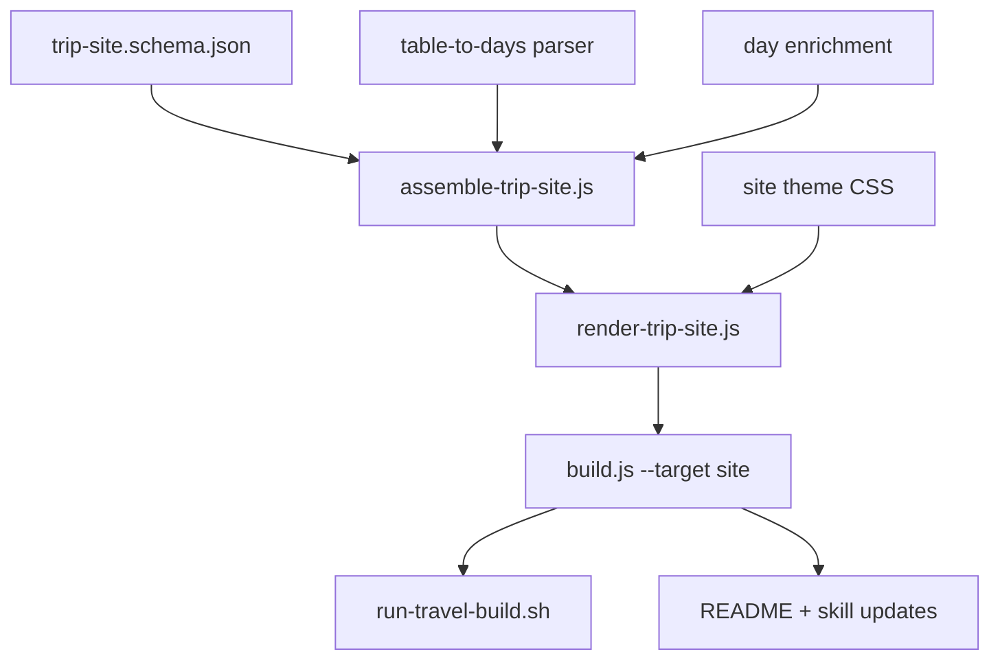

# PRD: Trip Itinerary Web Site (Inspirato-style)

**Status:** Draft  
**Author:** travel-genie planning  
**Date:** 2026-06-27  
**Source:** User request — replace PDF slide deck as primary deliverable with a shareable web itinerary site modeled on [Inspirato MyTrip](https://mytrip.inspirato.com/trip/itinerary/k5SSks4Acu6-BJLOAINF4gXAwJEBxBBAB8Cb-9SpKkcWixcLgMO9fQ).

---

## 1. Executive Summary

travel-genie today produces a **print-oriented slide deck** (`deck.html` + `deck.pdf`) from the same CoT planning pipeline and canonical JSON. Travelers increasingly want a **mobile-friendly, scrollable day-by-day itinerary** they can open on a phone during the trip — similar to luxury concierge platforms like Inspirato MyTrip.

This PRD defines a new **Stage 2 render target**: a self-contained **trip itinerary site** built from existing `pipeline/data/<slug>/*.json`, with the day-by-day view as the hero experience and deep-linkable sections for flights, hotels, dining, and reference content.

**Primary outcome:** `./scripts/run-travel-deck.sh <slug>` (renamed or extended) produces `pipeline/dist/<slug>/trip.html` as the default deliverable; PDF export becomes optional.

---

## 2. Problem Statement

### Current behavior

```
profile.md → CoT → opt-*.md → JSON → deck.html (1280×720 slides) → deck.pdf (Playwright)
```

- Output is optimized for **presentation and printing**, not in-trip mobile use.
- Master itinerary is **paginated across slides** (`master-itinerary.js` uses `parts[]` with featured day cards); many trips still land in **table fallback** because extraction does not populate structured `days[]`.
- Sharing requires sending a PDF or opening a large offline HTML file with horizontal slide semantics.
- Playwright + pdf-lib add build complexity and are unnecessary if the primary deliverable is web.

### Target behavior

A single scrollable page (plus optional section anchors) that reads like Inspirato MyTrip:

| Inspirato pattern | travel-genie mapping |
|-------------------|---------------------|
| Trip title (`Tolson \| Maison Tortue \| St. Kitts`) | `{traveler} \| {primary property or hub} \| {destination}` from profile + accommodation |
| Agent contact block | Optional footer / “Trip prepared by travel-genie” (no agent CRM in v1) |
| **Trip Day Title** (H2) | `Day N — Weekday, Date · Location · Theme` from master itinerary |
| **Event Name** (H3) + detail lines | Time-block events: Morning / Afternoon / Evening activities, enriched with hotel, meal, and transit context |
| — | Collapsible reference sections: Flights, Hotels, Immigration, Packing, Contingency |

Reference: [Inspirato MyTrip sample](https://mytrip.inspirato.com/trip/itinerary/k5SSks4Acu6-BJLOAINF4gXAwJEBxBBAB8Cb-9SpKkcWixcLgMO9fQ).

---

## 3. Goals

| ID | Goal |
|----|------|
| G1 | Generate a **self-contained `trip.html`** from existing canonical JSON with **no new AI step**. |
| G2 | **Day-by-day itinerary** is the default landing view — mobile-first, scrollable, readable at 375px width. |
| G3 | **Reuse Stage 1 data** (`pipeline/data/<slug>/*.json`); avoid duplicating extraction logic. |
| G4 | Enrich day events by **joining** master itinerary with accommodation, food, transport, and culture aspects where day numbers align. |
| G5 | Preserve **deterministic rendering** — same JSON → same HTML (byte-stable aside from timestamps if explicitly included). |
| G6 | Keep **deck.html / deck.pdf** as optional legacy output until parity is verified, then demote PDF in docs and scripts. |

## 4. Non-Goals (v1)

- Hosted SaaS with login, edit-in-place, or real-time sync.
- Inspirato agent CRM, booking buttons, or payment integration.
- Replacing the CoT planning workflow or `opt-*.md` authoring model.
- React/Vue SPA with npm build step (stay aligned with plain Node ESM + string templates unless scope expands).
- Public URL hosting / CDN deployment (document manual open or static host as follow-on).
- Interactive maps on the itinerary page (maps remain on route/shopping slides or a later v2 section).

---

## 5. User Personas

| Persona | Need |
|---------|------|
| **Traveler (primary)** | Glance at today’s plan on phone; expand an event for address, booking note, or backup plan. |
| **Travel partner** | Same link/file — no PDF zooming. |
| **Planner (author)** | Regenerate site after editing `opt-*.md` with one command; diff-friendly JSON cache. |
| **Agent / concierge (future)** | Branded header, contact block, shareable slug URL. |

---

## 6. Current Architecture (baseline)

| Layer | Location | Notes |
|-------|----------|-------|
| Planning | `trips/<slug>/opt-*.md` | Source of truth for content |
| Extract | `pipeline/src/extract/*.js` | Deterministic + optional AI |
| Canonical JSON | `pipeline/data/<slug>/*.json` | One file per aspect |
| Render | `pipeline/src/render/templates/*.js` | Slide templates, 1280×720 |
| Orchestrator | `pipeline/src/build.js` | `renderDeck()` → `dist/<slug>/deck.html` |
| PDF | `pipeline/src/export-pdf.js` | Playwright per-slide capture |
| Shell | `scripts/run-travel-deck.sh` | JSON → HTML → PDF |

**Key JSON sources for itinerary site:**

- `04-master-itinerary.json` — days, booking queue, trip overview
- `05-accommodation.json` — property names, check-in/out per hub
- `06-food-dining.json` — `meal_mapping.days[]`
- `07-transport-money.json` — flights, ground transport
- `traveler-profile.json` — title, dates, party, budget
- Sidecars: `flight-comparison.json`, `hotel-comparison.json`, `restaurant-comparison.json`, `attractions-comparison.json`

**Known gap:** `04-master-itinerary.json` often contains `tables[]` (markdown extract) rather than structured `parts[].days[]` expected by `master-itinerary.js`. The site builder needs a **normalization layer** that converts tables → canonical day/event model.

---

## 7. Proposed Solution

### 7.1 Architecture

```
opt-*.md → fill-from-opt.js → JSON (unchanged)
                                    ↓
                         assemble-trip-site.js  ← NEW: merge aspects → trip-site.json
                                    ↓
                         render-trip-site.js    ← NEW: trip.html template
                                    ↓
                         dist/<slug>/trip.html  ← NEW primary deliverable
                         dist/<slug>/deck.html  ← optional (--deck)
                         dist/<slug>/deck.pdf   ← optional (--pdf)
```

### 7.2 Canonical trip-site model (new contract)

Add `pipeline/schema/trip-site.schema.json`:

```json
{
  "trip": "china-vietnam-2026",
  "meta": {
    "title": "Tolson | Mondrian HK | Hong Kong · Vietnam",
    "subtitle": "Sept 1 – 14, 2026 · 2 travelers",
    "dates": { "start": "2026-09-01", "end": "2026-09-14" },
    "hero_image": "https://…"
  },
  "days": [
    {
      "day": 1,
      "title": "Tuesday, Sept 1 · En route · ATL → HKG",
      "location": "In transit",
      "theme": "Travel day",
      "events": [
        {
          "name": "Morning",
          "lines": ["Final pack; rideshare to ATL"],
          "kind": "transit",
          "tags": ["book-now"]
        }
      ],
      "footnotes": {
        "wow_moment": "…",
        "low_energy": "…",
        "rainy_day": "…",
        "transit": "…"
      }
    }
  ],
  "sections": [
    { "id": "flights", "title": "Flights", "aspect": "flight-comparison", "anchor": true },
    { "id": "hotels", "title": "Hotels", "aspect": "hotel-comparison", "anchor": true }
  ],
  "booking_queue": [],
  "generated_at": "ISO-8601"
}
```

### 7.3 Page layout (Inspirato-inspired)

```
┌─────────────────────────────────────────┐
│  HERO: Trip title + dates + key metrics │
├─────────────────────────────────────────┤
│  Sticky nav: Itinerary | Flights | …    │
├─────────────────────────────────────────┤
│  ## Day 1 — Title                       │
│  ### Morning                            │
│  Line one                               │
│  Line two                               │
│  ### Afternoon                          │
│  …                                      │
│  ───                                    │
│  ## Day 2 — Title                       │
│  …                                      │
├─────────────────────────────────────────┤
│  Reference sections (accordion/cards)   │
│  Flights · Hotels · Immigration · …     │
├─────────────────────────────────────────┤
│  Footer: travel-genie · trip slug       │
└─────────────────────────────────────────┘
```

**Visual direction:** Clean serif/sans pairing, generous whitespace, subtle day dividers, optional property hero image from `opt-*` frontmatter `hero-image`. Not a pixel clone of Inspirato — match **information architecture**, not brand assets.

### 7.4 Normalization rules

| Source | Rule |
|--------|------|
| Master itinerary `parts[].days[]` | Use directly if present |
| Master itinerary `tables[]` with caption `Day N — …` | Parse caption → day title; rows with Slot/Plan → events |
| `meal_mapping.days[]` | Merge into matching day as `### Dining` event or extra lines |
| Accommodation `top_picks` | Add check-in/out events on transition days |
| `07-transport-money` flights | Add flight events on departure/arrival days |
| Restaurant/attraction picks | Append to day lines when day number matches |

### 7.5 Render implementation

- New module: `pipeline/src/site/` mirroring `render/` patterns.
- `assemble-trip-site.js` — pure function, unit-testable, no DOM.
- `render-trip-site.js` — emits single HTML file; inline CSS (mobile-first); minimal JS for sticky nav + section expand only.
- Extend `build.js` with `--target site|deck|both` (default: `site`).
- Update `scripts/run-travel-deck.sh` → `run-travel-build.sh` with flags `--pdf`, `--deck`.

---

## 8. Domain-Tagged Requirements

### 8.1 [data] Extraction & assembly

| ID | Requirement | Priority |
|----|-------------|----------|
| D1 | Define `trip-site.schema.json` and validate assembled output in CI or smoke script | P0 |
| D2 | Implement `assemble-trip-site.js` reading all `pipeline/data/<slug>/*.json` | P0 |
| D3 | Implement table → days parser for legacy `04-master-itinerary.json` shape | P0 |
| D4 | Implement day enrichment from food, accommodation, transport aspects | P1 |
| D5 | Emit assembled cache to `pipeline/data/<slug>/trip-site.json` for debugging | P1 |
| D6 | Extend `fill-from-opt.js` / `md-extract.js` to prefer structured `parts[].days[]` in master itinerary extract | P2 |

### 8.2 [frontend] Site render

| ID | Requirement | Priority |
|----|-------------|----------|
| F1 | Mobile-first responsive layout (375px – 1440px) | P0 |
| F2 | Day sections with H2 day title, H3 event name, up to 4 detail lines per event (Inspirato parity) | P0 |
| F3 | Hero header with trip title pattern `{party} \| {hub} \| {countries}` | P0 |
| F4 | Sticky section nav with anchor links | P1 |
| F5 | Reference sections rendered from existing aspect JSON via simplified card templates (reuse dashboard field shapes) | P1 |
| F6 | Print stylesheet (`@media print`) — **primary PDF path** replacing Playwright default | P0 |
| F7 | Dark-on-light accessible contrast (WCAG AA body text) | P1 |

### 8.3 [backend] Pipeline / CLI

| ID | Requirement | Priority |
|----|-------------|----------|
| B1 | `node src/build.js <slug> --target site` writes `dist/<slug>/trip.html` | P0 |
| B2 | `--target both` builds site + deck; `--target deck` preserves current behavior | P0 |
| B3 | Shell script defaults to site; `--deck` opt-in for slide deck; `--pdf` opt-in for Playwright slide PDF only | P0 |
| B4 | `--only` flag applies to site section rendering where sensible | P2 |

### 8.4 [docs] Documentation & skills

| ID | Requirement | Priority |
|----|-------------|----------|
| DOC1 | Update root `README.md` — site as primary output, PDF secondary | P0 |
| DOC2 | Update `pipeline/README.md` with site build commands | P0 |
| DOC3 | Update `.cursor/skills/travel-cot-deck/SKILL.md` build phase | P1 |
| DOC4 | Add example prompt: “Build trip site for china-vietnam-2026” | P1 |

### 8.5 [infra] Deployment (v1)

| ID | Requirement | Priority |
|----|-------------|----------|
| I1 | Document opening `trip.html` locally (`file://`) and via `npx serve pipeline/dist/<slug>` | P0 |
| I2 | Add `scripts/publish-github-pages.sh` — `gh-pages` branch publish of `pipeline/dist/<slug>/` | P1 |

### 8.6 [testing] Verification

| ID | Requirement | Priority |
|----|-------------|----------|
| T1 | Snapshot test: `assemble-trip-site` output for `china-vietnam-2026` | P0 |
| T2 | Smoke test: built `trip.html` contains one H2 per itinerary day | P0 |
| T3 | Visual check at 375px viewport — no horizontal scroll on body | P1 |

---

## 9. Dependency Graph



**Critical path:** schema → assemble (+ table parser) → render → build CLI → docs

**Parallelizable after schema is drafted:**
- table parser ∥ enrichment rules ∥ site theme CSS
- reference section mini-templates ∥ sticky nav JS
- docs ∥ tests (once assemble API is stable)

---

## 10. Parallelization Summary

| Batch | Workstreams | Conflicts |
|-------|-------------|-----------|
| **1** | Schema + assemble skeleton + table parser | `pipeline/schema/`, `pipeline/src/site/assemble*.js` |
| **2** | Site render template + theme CSS | `pipeline/src/site/render*.js`, `theme-site.js` |
| **3** | build.js flags + shell script | `pipeline/src/build.js`, `scripts/` |
| **4** | Enrichment + reference sections | `assemble*.js`, section templates |
| **5** | Tests + docs + skill | `tests/`, `README.md`, `.cursor/skills/` |

---

## 11. Live Application Verification Criteria

Use trip slug **`china-vietnam-2026`** (complete JSON cache in repo).

| # | Check | Pass criteria |
|---|-------|---------------|
| V1 | Build | `./scripts/run-travel-build.sh china-vietnam-2026` exits 0; `pipeline/dist/china-vietnam-2026/trip.html` exists |
| V2 | Offline | Open `trip.html` with network disabled — page renders fully |
| V3 | Day coverage | HTML contains ≥ 10 day headings matching master itinerary day count |
| V4 | Event structure | Each day has ≥ 1 `h3` event with detail lines |
| V5 | Mobile | At 375px width, itinerary text readable without horizontal pan |
| V6 | Nav | Clicking “Flights” scrolls to flights reference section |
| V7 | Determinism | Two builds with `--skip-extract` produce identical HTML (excluding optional timestamp) |
| V8 | Print | `Ctrl+P` / print dialog on `trip.html` renders each day as a clean printed page |

---

## 12. Migration & Rollout

| Phase | Action |
|-------|--------|
| **v1** | Site is primary deliverable; print CSS replaces Playwright default; deck + Playwright slide PDF behind `--deck --pdf` |
| **v1.1** | GitHub Pages publish script; shareable URL per trip |

---

## 13. Assumptions

1. **Static HTML is sufficient for v1** — travelers open the file on phone via AirDrop, Drive, or local server.
2. **Structured day extraction will be improved incrementally** — table parser unblocks existing trips immediately.
3. **Inspirato IA, not visual clone** — no trademarked assets; layout similarity only.
4. **No auth** — trip slug is not secret; optional opaque filename acceptable later.
5. **Existing JSON aspects remain source of truth** — no new CoT steps required.

---

## 14. Decisions (resolved 2026-06-27)

| # | Question | Decision |
|---|----------|---------|
| Q1 | Trip title source? | **Humanized slug** — `china-vietnam-2026` → `China · Vietnam 2026` |
| Q2 | Which reference sections? | **Travel-day subset only:** Flights, Hotels, Food & Dining, Immigration, Health & Safety, Contingency |
| Q3 | Presenter mode link in site header? | **No** — deck.html stays a separate artifact |
| Q4 | GitHub Pages hosting? | **v1** — include static publish script in scope |
| Q5 | PDF strategy? | **Print CSS from site** — Playwright removed from default path; slide PDF kept only as dev opt-in (`--deck --pdf`) |

---

## 15. Success Metrics

| Metric | Target |
|--------|--------|
| Build time (site only) | < 5s for china-vietnam-2026 (no Playwright) |
| Mobile Lighthouse Performance | ≥ 90 (static, inlined CSS) |
| Day/event coverage | 100% of master itinerary days rendered |
| User-facing command change | One command produces shareable HTML |

---

## 16. Appendix: Inspirato → travel-genie field mapping

| Inspirato UI | travel-genie source field |
|--------------|---------------------------|
| Page title | `meta.title` ← profile + accommodation |
| Trip Day Title | `days[].title` |
| Event Name | `days[].events[].name` (Morning, Afternoon, Evening, or named activity) |
| Line One–Four | `days[].events[].lines[]` |
| — | `days[].footnotes.*` for wow/low-energy/rainy/transit |
